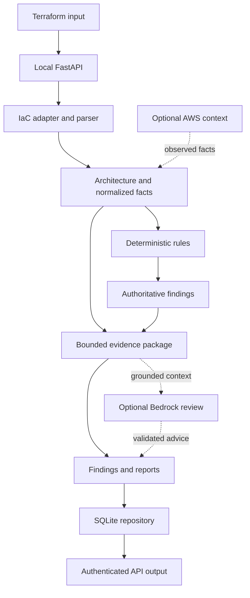

# CloudGuard

Evidence-grounded, deterministic review of AWS infrastructure defined in Terraform.

CloudGuard parses Terraform without executing it, builds a normalized architecture
and evidence inventory, evaluates versioned engineering rules, and produces
secret-redacted JSON and Markdown reports. Optional pipeline components can enrich
the review with read-only AWS observations and an Amazon Bedrock advisory pass,
while deterministic findings remain the source of truth.

The current application is a local, authenticated FastAPI service backed by
SQLite. Its default API composition performs offline Terraform analysis only;
the AWS context and Bedrock providers are implemented as injectable pipeline
components but are not enabled by the current HTTP request schema.

## Why CloudGuard?

Infrastructure review needs conclusions that are reproducible, traceable to
source evidence, and useful even when cloud APIs or an AI model are unavailable.
CloudGuard separates those responsibilities:

- deterministic rules decide whether findings exist, which resources they
  affect, their baseline severity, and the evidence that supports them;
- read-only AWS context can confirm, contradict, or supplement declared state
  without silently replacing it;
- a bounded evidence inventory retains resource, relationship, provenance, and
  omission metadata independently of whether findings exist; and
- Bedrock can prioritize and explain existing findings, but cannot create
  findings, change deterministic severity, execute actions, or access AWS tools.

## Architecture



The default local API follows the solid path and does not configure the two
optional external providers. `ReviewPipeline` supports those providers through
explicit dependency injection for deployments or direct application use.

## Core Design Principles

### Deterministic Infrastructure Analysis

The Terraform parser is custom, bounded, and non-executing. It does not invoke
Terraform, load providers, fetch modules, resolve remote data, inspect state, or
evaluate arbitrary expressions. Literal values are decoded where unambiguous;
other expressions are preserved as source text.

Parsed resources and evidence feed a catalog of 15 deterministic rules covering
reliability, security, operational excellence, and cost-optimization concerns.
Rules are enabled by default and can be disabled individually per review.
Findings are emitted only when reproducible evidence is available.

### Evidence-Grounded AI

`BedrockReviewService` sends a minimized, redacted, finding-scoped context to
the non-streaming Bedrock Runtime `Converse` API. No tools are configured.
Structured model output is validated again in the application:

- finding IDs must already exist;
- cited evidence must belong to that finding;
- evidence excerpts must occur in the cited deterministic evidence;
- unknown resources, unsupported fields, and duplicate findings are rejected;
- model priority remains advisory and cannot replace deterministic severity.

If Bedrock is disabled, unavailable, or returns invalid output, deterministic
findings remain intact. The pipeline records the optional stage as partial
rather than treating model output as authoritative.

### Read-Only AWS Context

`ReadOnlyAWSContextProvider` exposes a fixed allowlist of seven `Describe*`
operations across EC2, RDS, CloudWatch Logs, and ECS. It uses boto3's normal
credential chain, short SDK timeouts, standard retries, and an in-memory TTL
cache.

Declared and observed facts are reconciled as agreement, conflict,
declared-only, observed-only, or unknown. Existing rule policy continues to use
declared Terraform state. Missing credentials, denied access, endpoint errors,
and unmatched resources become diagnostics or unknown facts. They are not
proof that a resource or control is absent.

### Security Boundaries

- Terraform input is untrusted data and is never executed.
- Input bytes, document count, parser tokens, nesting, blocks, evidence size,
  model input/output, and concurrent reviews are bounded.
- Raw Terraform source is processed in memory and is not persisted.
- Evidence and reports redact sensitive keys, common credential patterns,
  bearer tokens, URL credentials, assignments, and private keys.
- The local API requires bearer authentication for every route except
  `/health`, uses constant-time token comparison, and returns no-store and
  browser-hardening headers.
- API keys and SQLite files use owner-only permissions where POSIX permissions
  are available.
- AWS context and Bedrock are designed for separate least-privilege roles;
  neither component contains infrastructure mutation or remediation calls.

Pattern-based redaction is defense in depth, not a guarantee that every
organization-specific secret format will be recognized. Avoid submitting real
secrets where possible.

### Reliable Review Processing

Reviews use a persisted lifecycle:

```text
RECEIVED -> PROCESSING -> COMPLETED
                       -> PARTIAL
                       -> FAILED
```

Input is canonicalized and hashed with SHA-256. The hash provides deterministic
review identity and content-level idempotency; a caller-supplied
`Idempotency-Key` cannot be reused for different content. SQLite state changes
run in immediate transactions with guarded transitions, attempt counters, and
timestamps.

The repository can recover stale processing records to `RECEIVED` while retry
capacity remains, or mark them failed after the configured limit. Recovery does
not replay work because raw source is not stored; an identical resubmission is
required. SQLite is intentionally a local single-host persistence choice, not a
multi-tenant or high-throughput distributed queue.

## Current Capabilities

- Single- or multi-document `.tf` submission with deterministic ordering and
  aggregate size limits
- Terraform resource, relationship, source-location, and declared-evidence
  extraction
- Format-neutral IaC adapter contract with a current Terraform implementation
- Normalized declared, observed, conflicting, and unknown fact models
- 15 deterministic rules with per-rule enablement
- Bounded architecture inventory and finding evidence with explicit omission
  metadata
- Secret-safe deterministic JSON and Markdown report generation
- Optional fixed-allowlist AWS context provider
- Optional finding-scoped Amazon Bedrock review with strict output validation
- SQLite persistence, idempotent submissions, guarded lifecycle transitions,
  stale-review recovery, and retry limits
- Authenticated local API with request limits, concurrency admission control,
  correlation IDs, typed errors, and structured metadata-only logs

## API

The server binds to `127.0.0.1:8000` by default. OpenAPI documentation is
available at `/docs` and is protected by the same bearer authentication as the
review endpoints.

| Method | Path | Purpose |
|---|---|---|
| `POST` | `/reviews` | Submit one or more Terraform documents for synchronous review |
| `GET` | `/reviews/{review_id}` | Retrieve lifecycle state, counts, and diagnostics |
| `GET` | `/reviews/{review_id}/findings` | Retrieve deterministic findings |
| `GET` | `/reviews/{review_id}/report` | Retrieve the JSON and Markdown report |
| `GET` | `/health` | Check SQLite persistence health; authentication is not required |

`POST /reviews` accepts either the single-document shape:

```json
{
  "filename": "main.tf",
  "content": "resource \"aws_s3_bucket\" \"logs\" {}",
  "rule_states": {}
}
```

or the multi-document shape:

```json
{
  "format": "terraform",
  "documents": [
    {
      "filename": "network.tf",
      "content": "resource \"aws_vpc\" \"main\" {}"
    },
    {
      "filename": "storage.tf",
      "content": "resource \"aws_s3_bucket\" \"logs\" {}"
    }
  ],
  "rule_states": {}
}
```

Only Terraform is accepted. File names must end in `.tf` and cannot contain
path components. See [`docs/local-api.md`](docs/local-api.md) for authentication
and operational details.

## Technology Stack

- Python 3.12+
- FastAPI and Pydantic for the local HTTP contract
- Uvicorn for local serving
- SQLite from the Python standard library for review persistence
- boto3/botocore for optional AWS context and Bedrock Runtime access
- pytest, Ruff, and mypy for development checks
- GitHub-native Mermaid for the architecture diagram

## Local Development

Create an environment and install the package with development dependencies:

```bash
python3.12 -m venv .venv
.venv/bin/python -m pip install --upgrade pip
.venv/bin/python -m pip install -e ".[dev]"
```

Run the test suite:

```bash
.venv/bin/python -m pytest -q
```

Start the local API with an explicit key:

```bash
export CLOUDGUARD_API_KEY="$(
  .venv/bin/python -c 'import secrets; print(secrets.token_urlsafe(32))'
)"
.venv/bin/cloudguard-api
```

If `CLOUDGUARD_API_KEY` is unset, CloudGuard creates
`.cloudguard/api.key`. Review data defaults to `.cloudguard/reviews.db`; set
`CLOUDGUARD_DB_PATH` to use another local path.

Example submission:

```bash
curl \
  -H "Authorization: Bearer ${CLOUDGUARD_API_KEY}" \
  -H "Content-Type: application/json" \
  -H "Idempotency-Key: example-review" \
  --data '{
    "filename": "main.tf",
    "content": "resource \"aws_db_instance\" \"example\" { publicly_accessible = true }",
    "rule_states": {}
  }' \
  http://127.0.0.1:8000/reviews
```

The API is intended for trusted local use. Do not expose it publicly without
TLS, stronger identity and authorization, distributed rate limiting, tenant
isolation, and operational monitoring.

## Project Structure

```text
src/cloudguard/
  api.py              Local FastAPI application and request controls
  api_schemas.py      Strict request and response models
  terraform.py        Bounded, non-executing Terraform parser and adapter
  iac.py              Format-neutral IaC contracts
  facts.py            Declared/observed fact normalization and reconciliation
  rules.py            Deterministic rule catalog and evaluation
  aws_context.py      Optional read-only AWS observation provider
  evidence.py         Bounded inventory, provenance, and redaction
  bedrock_review.py   Optional grounded Bedrock review and validation
  reports.py          Secret-safe JSON and Markdown reports
  pipeline.py         Review orchestration and failure semantics
  repository.py       SQLite lifecycle and idempotency persistence
  evaluation.py       Deterministic and model-output regression utilities
tests/                 Unit and integration tests plus Terraform fixtures
evaluations/           Versioned deterministic evaluation scenarios
docs/                  ADRs, IAM guidance, security review, API, and evaluations
scripts/               Evaluation report generation
```

## Engineering Decisions

The accepted architecture decisions document the current boundaries:

- [ADR 001: Normalized declared and observed facts](docs/adr-001-normalized-facts.md)
- [ADR 002: Bounded architecture inventory](docs/adr-002-bounded-architecture-inventory.md)
- [ADR 003: Review pipeline orchestration](docs/adr-003-review-pipeline-orchestration.md)
- [ADR 004: Format-neutral IaC adapter boundary](docs/adr-004-iac-adapter-boundary.md)
- [ADR 005: Finding-scoped AI grounding boundary](docs/adr-005-ai-grounding-boundary.md)
- [ADR 006: Reliable local review processing](docs/adr-006-reliable-review-processing.md)

## Security

The repository includes a scoped
[security review](docs/security-review.md), plus least-privilege guidance for
the [AWS context provider](docs/aws-context-iam.md) and
[Bedrock review layer](docs/bedrock-review-iam.md).

Known residual risks include the limits of pattern-based secret detection,
custom-parser assurance, prompt influence on advisory prose, local bearer-token
authentication, SQLite isolation, and the absence of distributed abuse and
cost controls. These are documented rather than hidden behind a
“production-ready” claim.

## Testing and Evaluation

The test suite covers parsing, adapters, domain invariants, fact
reconciliation, deterministic rules, AWS failure semantics, evidence bounding
and redaction, Bedrock grounding validation, reports, pipeline partial/failure
states, SQLite transitions, and the authenticated API.

The checked-in [evaluation regression report](docs/evaluation-regression.md)
contains 30 deterministic scenarios, all passing at generation time. Its
Bedrock cases test the validation contract with synthetic output; they are not
live foundation-model quality or latency benchmarks.

The current repository test run contains 149 passing tests and 2 passing
subtests. Dependency deprecation warnings may be emitted by the FastAPI test
client stack.

## Roadmap

The following capabilities are not currently part of the shipped local API:

- explicit application configuration and API workflows for enabling the
  implemented AWS context and Bedrock providers;
- additional IaC adapters such as CloudFormation or Terraform plan JSON;
- full Terraform module loading, cross-file expression evaluation, provider
  resolution, or state ingestion;
- distributed queues/workers, multi-host persistence, tenant isolation,
  fine-grained authorization, and distributed rate limits;
- automated remediation or infrastructure mutation;
- coverage-guided parser fuzzing and larger untrusted-input corpora;
- approved-model live Bedrock quality, latency, token, and cost baselines;
- operator controls such as persistent per-tenant quotas, budgets, model
  allowlists, and an invocation kill switch.

## Project Status

CloudGuard is an engineering portfolio project at version `0.1.0`. The
deterministic local review path, optional provider components, persistence
model, security controls, and regression suite are implemented. The roadmap
above identifies the work required before treating it as a shared,
internet-facing service.
